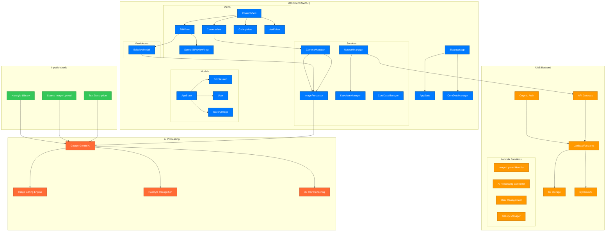

# ilikeyacut - High-Level App Architecture

```mermaid
graph TB
    subgraph "iOS Client (SwiftUI)"
        A[ilikeyacutApp] --> B[AppState]
        A --> C[CoreDataManager]
        
        subgraph "Views"
            D[ContentView] --> E[CameraView]
            D --> F[EditView]
            D --> G[GalleryView]
            D --> H[AuthView]
            F --> I[SceneKitPreviewView]
        end
        
        subgraph "ViewModels"
            J[EditViewModel]
        end
        
        subgraph "Services"
            K[CameraManager] --> L[ImageProcessor]
            M[NetworkManager] --> N[KeychainManager]
            O[CoreDataManager]
        end
        
        subgraph "Models"
            P[AppState] --> Q[EditSession]
            P --> R[User]
            P --> S[GalleryImage]
        end
    end
    
    subgraph "AI Processing"
        T[Google Gemini AI] --> U[Image Editing Engine]
        T --> V[Hairstyle Recognition]
        T --> W[3D Hair Rendering]
    end
    
    subgraph "AWS Backend"
        X[API Gateway] --> Y[Lambda Functions]
        Y --> Z[S3 Storage]
        Y --> AA[DynamoDB]
        AB[Cognito Auth] --> Y
        
        subgraph "Lambda Functions"
            Y1[Image Upload Handler]
            Y2[AI Processing Controller]
            Y3[User Management]
            Y4[Gallery Manager]
        end
    end
    
    subgraph "Input Methods"
        AC[Text Description]
        AD[Source Image Upload]
        AE[Hairstyle Library]
    end
    
    %% Connections
    E --> K
    F --> J
    J --> L
    M --> X
    L --> T
    K --> L
    AC --> T
    AD --> T
    AE --> T
    
    %% Styling
    classDef iosClass fill:#007AFF,stroke:#005CBB,stroke-width:2px,color:white
    classDef aiClass fill:#FF6B35,stroke:#CC5529,stroke-width:2px,color:white
    classDef awsClass fill:#FF9900,stroke:#CC7700,stroke-width:2px,color:white
    classDef inputClass fill:#34C759,stroke:#2BA946,stroke-width:2px,color:white
    
    class A,B,C,D,E,F,G,H,I,J,K,L,M,N,O,P,Q,R,S iosClass
    class T,U,V,W aiClass
    class X,Y,Z,AA,AB,Y1,Y2,Y3,Y4 awsClass
    class AC,AD,AE inputClass
```