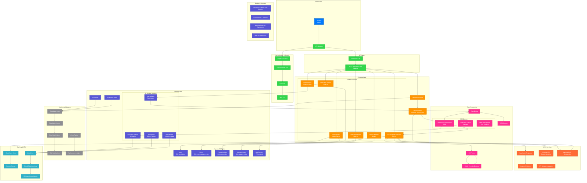

# ilikeyacut - AWS Infrastructure Diagram

```mermaid
graph TB
    subgraph "Client Layer"
        A[iOS App<br/>SwiftUI] --> B[API Gateway]
    end
    
    subgraph "API Layer"
        B --> C[CloudFront CDN]
        C --> D[ALB - Application Load Balancer]
    end
    
    subgraph "Authentication & Security"
        E[Cognito User Pool] --> F[Cognito Identity Pool]
        F --> G[IAM Roles]
        G --> H[AWS STS]
    end
    
    subgraph "Compute Layer"
        D --> I[Lambda Functions]
        
        subgraph "Lambda Functions"
            I1[Auth Handler<br/>Node.js/Python]
            I2[Image Upload<br/>Node.js/Python]
            I3[AI Processing Controller<br/>Python]
            I4[User Management<br/>Node.js]
            I5[Gallery Manager<br/>Node.js]
            I6[Notification Service<br/>Node.js]
        end
        
        I --> J[Step Functions<br/>Workflow Orchestration]
    end
    
    subgraph "AI/ML Services"
        K[SageMaker Endpoints] --> L[Custom AI Models]
        M[External API<br/>Google Gemini AI] --> N[API Gateway Integration]
        O[Lambda for AI Orchestration]
    end
    
    subgraph "Storage Layer"
        P[S3 Buckets]
        
        subgraph "S3 Storage Structure"
            P1[user-uploads/<br/>Raw Images]
            P2[processed-images/<br/>AI Results]
            P3[thumbnails/<br/>Gallery Previews]
            P4[static-assets/<br/>Hairstyle Library]
        end
        
        Q[DynamoDB Tables]
        
        subgraph "DynamoDB Tables"
            Q1[Users<br/>GSI: email-index]
            Q2[Photos<br/>GSI: user-timestamp-index]
            Q3[ProcessingJobs<br/>GSI: status-index]
            Q4[HairstyleLibrary<br/>GSI: category-index]
            Q5[UserSessions<br/>TTL enabled]
        end
    end
    
    subgraph "Monitoring & Logging"
        R[CloudWatch Logs] --> S[CloudWatch Metrics]
        S --> T[CloudWatch Alarms]
        T --> U[SNS Notifications]
        V[X-Ray Tracing] --> W[Performance Insights]
    end
    
    subgraph "Event Processing"
        X[EventBridge] --> Y[SQS Queues]
        
        subgraph "SQS Queues"
            Y1[Image Processing Queue<br/>FIFO]
            Y2[Notification Queue<br/>Standard]
            Y3[Dead Letter Queue<br/>Error Handling]
        end
        
        Z[SNS Topics] --> AA[Mobile Push Notifications]
    end
    
    subgraph "Caching & CDN"
        AB[ElastiCache Redis] --> AC[Session Storage]
        AD[CloudFront] --> AE[Global Edge Locations]
        AE --> AF[S3 Origin Access Identity]
    end
    
    subgraph "Backup & Recovery"
        AG[DynamoDB Point-in-Time Recovery]
        AH[S3 Versioning & Lifecycle]
        AI[Lambda Reserved Concurrency]
        AJ[Multi-AZ Deployment]
    end
    
    %% API Flow Connections
    B --> E
    D --> I1
    D --> I2
    D --> I3
    D --> I4
    D --> I5
    D --> I6
    
    %% Processing Flow
    I2 --> P1
    I3 --> K
    I3 --> M
    I3 --> O
    O --> J
    J --> Y1
    Y1 --> P2
    
    %% Data Flow
    I1 --> Q1
    I2 --> Q2
    I3 --> Q3
    I4 --> Q4
    I5 --> Q5
    
    %% Monitoring Connections
    I --> R
    P --> R
    Q --> R
    
    %% Event Flow
    P1 --> X
    X --> Y1
    Y1 --> I3
    I3 --> Z
    Z --> AA
    
    %% Caching Flow
    I1 --> AB
    P2 --> AD
    P3 --> AD
    P4 --> AD
    
    %% Styling
    classDef clientClass fill:#007AFF,stroke:#005CBB,stroke-width:2px,color:white
    classDef apiClass fill:#32D74B,stroke:#28B946,stroke-width:2px,color:white
    classDef computeClass fill:#FF9500,stroke:#E6850E,stroke-width:2px,color:white
    classDef storageClass fill:#5856D6,stroke:#4A49C4,stroke-width:2px,color:white
    classDef aiClass fill:#FF6B35,stroke:#CC5529,stroke-width:2px,color:white
    classDef monitorClass fill:#8E8E93,stroke:#6D6D78,stroke-width:2px,color:white
    classDef eventClass fill:#FF2D92,stroke:#E5297A,stroke-width:2px,color:white
    classDef cacheClass fill:#30B0C7,stroke:#2A9BB5,stroke-width:2px,color:white
    
    class A clientClass
    class B,C,D apiClass
    class E,F,G,H apiClass
    class I,I1,I2,I3,I4,I5,I6,J computeClass
    class K,L,M,N,O aiClass
    class P,P1,P2,P3,P4,Q,Q1,Q2,Q3,Q4,Q5 storageClass
    class R,S,T,U,V,W monitorClass
    class X,Y,Y1,Y2,Y3,Z,AA eventClass
    class AB,AC,AD,AE,AF cacheClass
    class AG,AH,AI,AJ storageClass
```