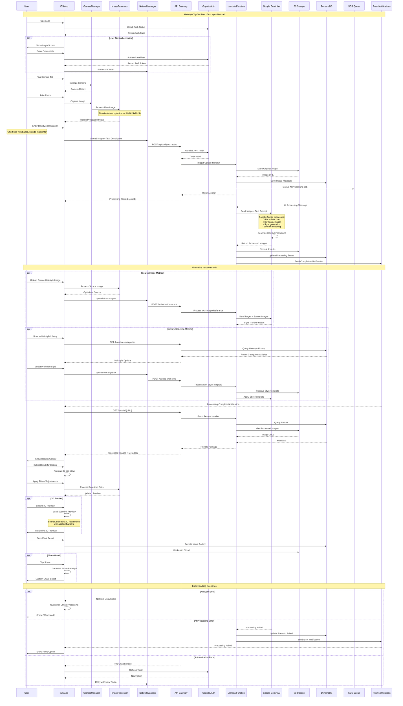

# ilikeyacut - Main Functionality Sequence Diagram

```mermaid
sequenceDiagram
    participant U as User
    participant iOS as iOS App
    participant Cam as CameraManager
    participant IP as ImageProcessor
    participant NM as NetworkManager
    participant API as API Gateway
    participant Auth as Cognito Auth
    participant Lambda as Lambda Function
    participant AI as Google Gemini AI
    participant S3 as S3 Storage
    participant DB as DynamoDB
    participant SQS as SQS Queue
    participant Push as Push Notifications
    
    Note over U,Push: Hairstyle Try-On Flow - Text Input Method
    
    %% Authentication Flow
    U->>iOS: Open App
    iOS->>Auth: Check Auth Status
    Auth-->>iOS: Return Auth State
    
    opt User Not Authenticated
        iOS->>U: Show Login Screen
        U->>iOS: Enter Credentials
        iOS->>Auth: Authenticate User
        Auth-->>iOS: Return JWT Token
        iOS->>NM: Store Auth Token
    end
    
    %% Camera Capture Flow
    U->>iOS: Tap Camera Tab
    iOS->>Cam: Initialize Camera
    Cam-->>iOS: Camera Ready
    U->>iOS: Take Photo
    iOS->>Cam: Capture Image
    Cam->>IP: Process Raw Image
    
    Note over IP: Fix orientation, optimize for AI (1024x1024)
    IP-->>iOS: Return Processed Image
    
    %% Text Input Method
    U->>iOS: Enter Hairstyle Description
    Note over U: "Short bob with bangs, blonde highlights"
    
    %% Network Upload & Processing
    iOS->>NM: Upload Image + Text Description
    NM->>API: POST /upload (with auth)
    API->>Auth: Validate JWT Token
    Auth-->>API: Token Valid
    
    API->>Lambda: Trigger Upload Handler
    Lambda->>S3: Store Original Image
    S3-->>Lambda: Image URL
    Lambda->>DB: Save Image Metadata
    Lambda->>SQS: Queue AI Processing Job
    Lambda-->>API: Return Job ID
    API-->>iOS: Processing Started (Job ID)
    
    %% AI Processing Flow
    SQS->>Lambda: AI Processing Message
    Lambda->>AI: Send Image + Text Prompt
    
    Note over AI: Google Gemini processes:<br/>- Face detection<br/>- Hair segmentation<br/>- Style generation<br/>- 3D hair rendering
    
    AI->>AI: Generate Hairstyle Variations
    AI-->>Lambda: Return Processed Images
    
    Lambda->>S3: Store AI Results
    Lambda->>DB: Update Processing Status
    Lambda->>Push: Send Completion Notification
    
    %% Alternative Input Methods
    Note over U,Push: Alternative Input Methods
    
    opt Source Image Method
        U->>iOS: Upload Source Hairstyle Image
        iOS->>IP: Process Source Image
        IP-->>iOS: Optimized Source
        iOS->>NM: Upload Both Images
        NM->>API: POST /upload-with-source
        API->>Lambda: Process with Image Reference
        Lambda->>AI: Send Target + Source Images
        AI-->>Lambda: Style Transfer Result
    end
    
    opt Library Selection Method
        U->>iOS: Browse Hairstyle Library
        iOS->>API: GET /hairstyles/categories
        API->>DB: Query Hairstyle Library
        DB-->>API: Return Categories & Styles
        API-->>iOS: Hairstyle Options
        U->>iOS: Select Preferred Style
        iOS->>NM: Upload with Style ID
        NM->>API: POST /upload-with-style
        API->>Lambda: Process with Style Template
        Lambda->>S3: Retrieve Style Template
        Lambda->>AI: Apply Style Template
    end
    
    %% Result Retrieval Flow
    Push-->>iOS: Processing Complete Notification
    iOS->>API: GET /results/{jobId}
    API->>Lambda: Fetch Results Handler
    Lambda->>DB: Query Results
    Lambda->>S3: Get Processed Images
    S3-->>Lambda: Image URLs
    DB-->>Lambda: Metadata
    Lambda-->>API: Results Package
    API-->>iOS: Processed Images + Metadata
    
    %% Edit & Preview Flow
    iOS->>U: Show Results Gallery
    U->>iOS: Select Result for Editing
    iOS->>iOS: Navigate to Edit View
    U->>iOS: Apply Filters/Adjustments
    iOS->>IP: Process Real-time Edits
    IP-->>iOS: Updated Preview
    
    %% 3D Preview Flow
    opt 3D Preview
        U->>iOS: Enable 3D Preview
        iOS->>iOS: Load SceneKit Preview
        Note over iOS: SceneKit renders 3D head model<br/>with applied hairstyle
        iOS->>U: Interactive 3D Preview
    end
    
    %% Save & Share Flow
    U->>iOS: Save Final Result
    iOS->>DB: Save to Local Gallery
    iOS->>S3: Backup to Cloud
    
    opt Share Result
        U->>iOS: Tap Share
        iOS->>iOS: Generate Share Package
        iOS->>U: System Share Sheet
    end
    
    %% Error Handling
    Note over U,Push: Error Handling Scenarios
    
    alt Network Error
        NM->>iOS: Network Unavailable
        iOS->>iOS: Queue for Offline Processing
        iOS->>U: Show Offline Mode
    else AI Processing Error
        AI-->>Lambda: Processing Failed
        Lambda->>DB: Update Status to Failed
        Lambda->>Push: Send Error Notification
        Push-->>iOS: Processing Failed
        iOS->>U: Show Retry Option
    else Authentication Error
        API-->>iOS: 401 Unauthorized
        iOS->>Auth: Refresh Token
        Auth-->>iOS: New Token
        iOS->>NM: Retry with New Token
    end
```